# Raspberry Pi Zero 2 W Recorder — System Flow & Architecture

Dokumentasi alur kerja dan arsitektur sistem perekam video/foto berbasis Raspberry Pi Zero 2 W dengan sensor kamera OV5647 dan mikrofon ALSA USB.

```mermaid
flowchart TD
    %% ════════════════════════════════════════════════
    %% Styling
    %% ════════════════════════════════════════════════
    classDef stage fill:#1e1e2e,stroke:#89b4fa,stroke-width:2px,color:#cdd6f4;
    classDef action fill:#181825,stroke:#6c7086,stroke-width:1px,color:#cdd6f4;
    classDef decision fill:#313244,stroke:#f9e2af,stroke-width:2px,color:#f9e2af;
    classDef success fill:#11111b,stroke:#a6e3a1,stroke-width:2px,color:#a6e3a1;
    classDef error fill:#11111b,stroke:#f38ba8,stroke-width:2px,color:#f38ba8;

    %% ════════════════════════════════════════════════
    %% 1. Boot & Hardware Init
    %% ════════════════════════════════════════════════
    subgraph S1 ["1. BOOT & INITIALIZATION"]
        direction TB
        A0(["▶ START: python3 recorder.py"]):::stage
        A1["Read config.py<br/>• GPIO: Photo 17/27 · Record 23/24<br/>• Debounce: 300 ms<br/>• Sensor OV5647: 2592×1944 (5MP)<br/>• Video: 1080p24 @ 6 Mbps<br/>• Audio: ALSA AB13X 48kHz AAC"]:::action
        A2["Process & PID Management<br/>• Read /tmp/recorder.pid<br/>• Terminate stale PID<br/>• Register current PID"]:::action
        A3["GPIO Hardware Setup<br/>• BTN_PHOTO (GPIO 17, Pull-Up)<br/>• LED_PHOTO (GPIO 27, OFF)<br/>• BTN_RECORD (GPIO 23, Pull-Up)<br/>• LED_RECORD (GPIO 24, OFF)"]:::action
        A4["Picamera2 Dual-Stream Init<br/>• main: 1920×1080 YUV420 (Video/Photo)<br/>• lores: 640×360 (Zero-CPU HW ISP)<br/>• Sensor warmed up at boot"]:::action

        A0 --> A1 --> A2 --> A3 --> A4
    end

    %% ════════════════════════════════════════════════
    %% 2. Standby & Services
    %% ════════════════════════════════════════════════
    subgraph S2 ["2. SERVICES & STANDBY LOOP"]
        direction TB
        B1["Open IPC Unix Socket<br/>/tmp/recorder_control.sock"]:::action
        B2["Start Web Server (:80)<br/>Dashboard, SSE, lores MJPEG"]:::action
        B3[["⏳ Standby Event Loop<br/>Listening for Button / IPC / Web"]]:::stage

        B1 --> B2 --> B3
    end

    S1 --> S2

    %% ════════════════════════════════════════════════
    %% 3. Trigger Routing
    %% ════════════════════════════════════════════════
    subgraph S3 ["3. TRIGGER DISPATCHER"]
        direction TB
        C0{"Trigger Event?"}:::decision
        C0 -->|"Photo Trigger<br/>(GPIO 17 / API / IPC)"| C1["Photo Pipeline"]:::action
        C0 -->|"Record Trigger<br/>(GPIO 23 / API / IPC)"| D1["Video Pipeline"]:::action
    end

    S2 --> S3

    %% ════════════════════════════════════════════════
    %% 4. Photo Flow
    %% ════════════════════════════════════════════════
    subgraph S4 ["4. PHOTO CAPTURE PIPELINE"]
        direction TB
        P1["Debounce Check (300 ms)"]:::action
        P2["LED_PHOTO = ON<br/>SSE: is_capturing = true"]:::action
        P3["capture_file(path, name='main')<br/>• Instant Snapshot (~75ms)<br/>• Captures DURING video recording<br/>• Preview stream stays uninterrupted"]:::action
        P4{"File Size > 0?"}:::decision
        P5["LED_PHOTO = OFF<br/>SSE: photo_done + filename"]:::success
        P6["Log Error<br/>LED_PHOTO = OFF<br/>SSE: error"]:::error
        P7(["↺ Photo Complete (Standby)"]):::stage

        P1 --> P2 --> P3 --> P4
        P4 -->|"YES"| P5 --> P7
        P4 -->|"NO"| P6 --> P7
    end

    C1 --> S4

    %% ════════════════════════════════════════════════
    %% 5. Video Flow
    %% ════════════════════════════════════════════════
    subgraph S5 ["5. VIDEO RECORDING PIPELINE"]
        direction TB
        V1["Debounce Check (300 ms)"]:::action
        V2{"Currently<br/>Recording?"}:::decision
        
        V3["Start Recording<br/>• DCIM/VID_YYYYMMDD_HHMMSS.ts<br/>• LED_RECORD = ON (solid)<br/>• SSE: is_recording = true"]:::action
        V4["Picamera2 H.264 + FFmpeg Muxer<br/>• 1080p @ 24fps HW VideoCore IV<br/>• ALSA Audio AAC 48kHz Stereo<br/>• MPEG-TS Crash-Resilient Mux<br/>• lores MJPEG continues streaming"]:::success
        V5(["↺ Recording in Progress"]):::stage

        V6["Stop Recording<br/>• stop_recording()<br/>• Flush TS packets & audio<br/>• LED_RECORD = OFF<br/>• SSE: is_recording = false"]:::action
        V7["✓ Saved to DCIM/*.ts"]:::success
        V8(["↺ Standby Loop"]):::stage

        V1 --> V2
        V2 -->|"NO (Start)"| V3 --> V4 --> V5
        V2 -->|"YES (Stop)"| V6 --> V7 --> V8
    end

    D1 --> S5

    %% ════════════════════════════════════════════════
    %% 6. Web & IPC Endpoints
    %% ════════════════════════════════════════════════
    subgraph S6 ["6. WEB UI & IPC CONTROL LAYER (:80)"]
        direction TB
        W1["GET / → Dashboard HTML (Dark UI, 16:9 view)"]:::action
        W2["GET /preview → Live MJPEG from lores (15 FPS)"]:::action
        W3["GET /events → SSE stream (status, timer, events)"]:::action
        W4["POST /api/photo · POST /api/record → Triggers"]:::action
        W5["GET /api/footage · GET /api/mics → File/Device List"]:::action

        W1 --> W2 --> W3 --> W4 --> W5
    end

    S4 --> S6
    S5 --> S6

    %% ════════════════════════════════════════════════
    %% 7. Resilience & Daemon
    %% ════════════════════════════════════════════════
    subgraph S7 ["7. CRASH RESILIENCE & SYSTEMD"]
        direction TB
        R1["MPEG-TS Crash Resilience<br/>• 188-byte independent packet chunks<br/>• PAT/PMT + IDR written every 1s<br/>• No MOOV atom dependency at EOF<br/>• Power cuts preserve all footage"]:::stage
        R2["systemd: recorder.service<br/>• After=network.target sound.target<br/>• User=root (port 80 binding)<br/>• Restart=on-failure (RestartSec=3s)<br/>• Enabled at boot"]:::stage

        R1 --> R2
    end

    S6 --> S7
```

---

## Ringkasan Fitur Arsitektur

| Komponen | Karakteristik Utama |
| :--- | :--- |
| **Dual-Stream Pipeline** | Stream `main` (1080p) untuk perekaman video & foto instan; stream `lores` (640×360) untuk live web preview via hardware ISP tanpa beban CPU tambahan. |
| **Instant Snapshots** | Mengambil foto resolusi tinggi (~75 ms) tanpa menjeda live preview atau proses perekaman video yang sedang berlangsung. |
| **Crash Resilience** | Kontainer MPEG-TS (`.ts`) menjamin rekaman tersimpan utuh dan dapat diputar meskipun terjadi pemadaman daya tiba-tiba. |
| **Web Dashboard** | Web dashboard real-time berbasis Server-Sent Events (SSE) dan live MJPEG preview untuk monitoring & kontrol jarak jauh. |
| **Daemon Autostart** | Dikelola oleh `systemd` dengan auto-restart dan berjalan otomatis saat Raspberry Pi booting. |
